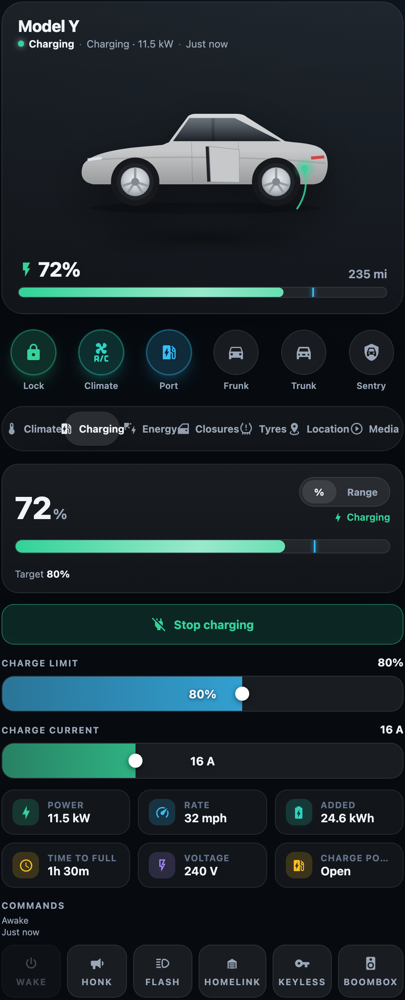
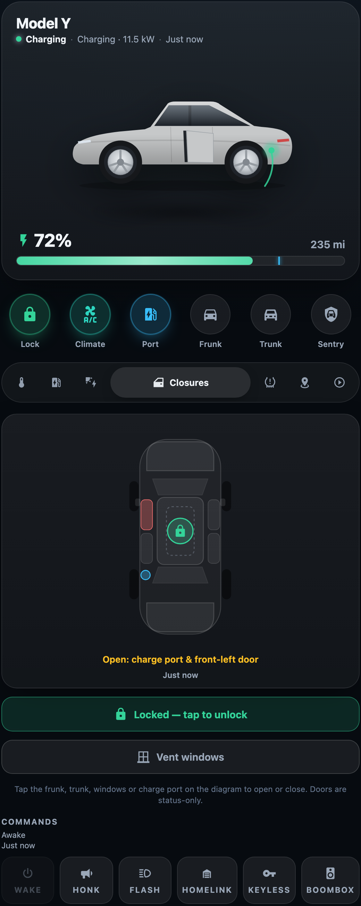
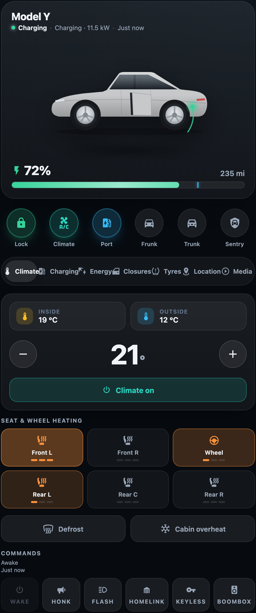
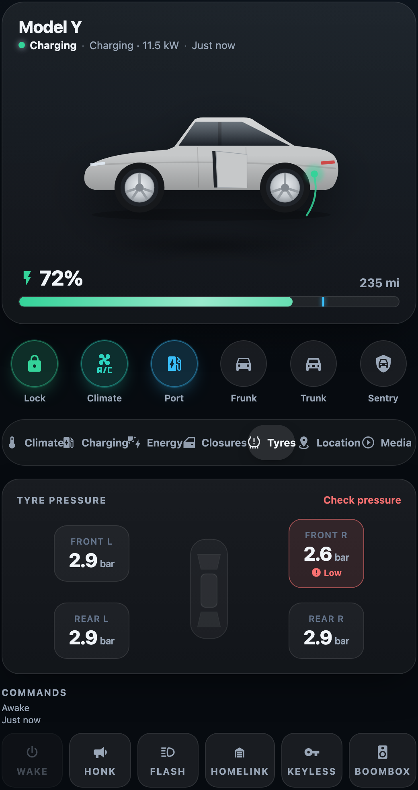
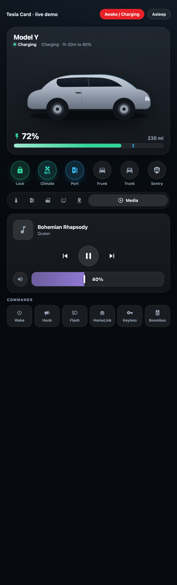
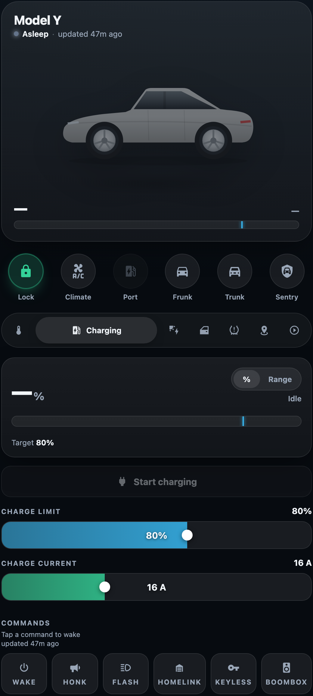

# Tesla Card

A Tesla-app-inspired vehicle card for Home Assistant, built for the
**Tesla Fleet** / **Teslemetry** integrations. Centred car render, circular
quick-action controls, and six purpose-built detail panels — a tappable
closures diagram, live charging controls, climate with seat heaters, tyre
pressures, a map, and the media player.



## Features

- **Centred hero** — your car render front-and-centre with a live battery
  bar, charge-limit marker, charging shimmer, and a status line that reads
  *Charging · 1h 30m to 80%*, *Parked · Locked*, *Driving*, or *Asleep*.
- **Quick actions** — circular toggles for lock, climate, charge port, frunk,
  trunk, and sentry. Active controls light up in their own accent colour.
- **Closures diagram** — a top-down car schematic. Tap the frunk, trunk,
  windows, or charge port to open/close; doors show open/closed status; a
  centre lock glyph and a primary lock button keep it secure. No more a wall
  of identical buttons.
- **Charging** — battery summary, start/stop, draggable charge-limit and
  charge-current sliders, plus power / rate / energy / time-to-full / voltage.
- **Energy** — when a Tesla **Powerwall** / **Wall Connector** is detected, a
  live power-flow diagram (solar · grid · Powerwall · home · car) with animated
  directional flows, plus backup-reserve, operation-mode and charging-session
  readouts. The tab auto-appears only when you have an energy site.
- **Climate** — temperature stepper, per-seat heater cyclers (Off→Low→Med→High),
  steering-wheel heater, defrost, and cabin-overheat protection.
- **Tyres** — pressures laid out at each corner of the car with low-pressure
  warnings.
- **Location** — embedded OpenStreetMap with odometer, speed, power, and live
  ETA when a route is active.
- **Media** — now-playing, transport, and a volume slider.
- **Graceful asleep state** — when the vehicle is offline the card dims rather
  than showing a wall of *Unknown*.
- **Built-in car render** — ships with a clean, recolorable EV illustration, so
  a zero-config card looks right immediately. Swap in your own `image:` or a
  layered `body:` render whenever you like.
- **Zero entity config** — auto-detects your Tesla device and resolves every
  entity by its stable function-name, so it works whatever your vehicle is
  called. Every key is still overridable.

## Screenshots

|  |  |  |
| :---: | :---: | :---: |
|  |  |  |
| Tappable **closures** diagram | **Climate** & seat heaters | **Tyre** pressures |
|  |  |  |
| **Media** player | Graceful **asleep** state | **Charging** controls |

## Installation

### HACS (recommended)

1. HACS → **⋮** → *Custom repositories*.
2. Add `https://github.com/mlmeehan/tesla-card` with category **Dashboard**.
3. Install **Tesla Card**, then reload your browser.

The resource is registered automatically. For YAML-mode dashboards add:

```yaml
resources:
  - url: /hacsfiles/tesla-card/tesla-card.js
    type: module
```

### Manual

1. Download `tesla-card.js` from the [latest release](https://github.com/mlmeehan/tesla-card/releases).
2. Copy it to `config/www/tesla-card.js`.
3. *Settings → Dashboards → ⋮ → Resources → Add* `/local/tesla-card.js` as a
   **JavaScript module**.

## Usage

The minimal card — it auto-detects your Tesla and shows a clean built-in car
illustration, so there's nothing else to configure:

```yaml
type: custom:tesla-card
name: Model Y
```

The built-in render recolours to any paint (see [Paint](#paint)):

```yaml
type: custom:tesla-card
name: Model Y
paint: blue
```

Prefer your own render? Point `image:` at a file in `config/www/` (a transparent
PNG works best):

```yaml
type: custom:tesla-card
image: /local/model_y.png
```

## Options

| Option               | Type    | Default          | Description                                          |
| -------------------- | ------- | ---------------- | ---------------------------------------------------- |
| `type`               | string  | —                | `custom:tesla-card` (required).                      |
| `name`               | string  | `Model Y`        | Vehicle name shown in the hero.                      |
| `image`              | string  | _built-in EV_    | Custom flat car render URL. When unset (and no `body`), the card shows its built-in recolorable EV illustration. |
| `body`               | map     | _none_           | Recolorable car-body layer set — see [Recolorable car body](#recolorable-car-body). |
| `paint`              | string \| map | _silver_   | Body colour for the built-in render or a `body` layer set: a CSS colour, a generic colour-preset name, or an entity source — see [Paint](#paint). |
| `energy`             | map     | _auto_           | Energy-site / Wall-Connector wiring + hide switch — see [Energy panel](#energy-panel). |
| `device`             | string  | _auto_           | Vehicle device id or name, if you have more than one Tesla. |
| `prefix`             | string  | _auto_           | Force the entity-id prefix slug (e.g. `model_y`). Rarely needed. |
| `default_panel`      | string  | `charging`       | One of `climate`, `charging`, `energy`, `closures`, `tyres`, `location`, `media`. |
| `hide_quick_actions` | boolean | `false`          | Hide the circular quick-action row.                  |
| `hide_panels`        | boolean | `false`          | Hide the tabbed detail panels.                       |
| `hide_commands`      | boolean | `false`          | Hide the command buttons (wake/honk/flash/…).        |
| `entities`           | map     | _auto_           | Per-key entity overrides — see below.                |

### Entity resolution (automatic)

You normally **don't configure any entities**. The card finds your Tesla device
from the integration and resolves every value it needs by the entity's stable
function-name — the language-independent slug of its friendly name, e.g.
*Time to full charge* → `time_to_full_charge`. Only the device-name prefix of an
entity id varies between installs (`garage_model_y_…` vs `model_y_…` vs
`tesla_…`); the function-name does not, so matching on it works across
environments without hard-coded ids.

If you have **more than one Tesla**, point the card at the right one by device
name (or registry id):

```yaml
type: custom:tesla-card
device: Model Y          # or the device's name in Settings → Devices
```

### Entity overrides (escape hatch)

Auto-resolution falls back to sensible defaults, so overrides are only needed
when something is renamed unusually. Override only the keys that differ:

```yaml
type: custom:tesla-card
entities:
  battery_level: sensor.my_tesla_battery_level
  lock: lock.my_tesla_lock
  charge_limit: number.my_tesla_charge_limit
  # …any of the keys in src/const.ts
```

The full list of keys (≈80) lives in [`src/const.ts`](src/const.ts).

## Recolorable car body

Out of the box the hero shows a **built-in EV illustration** that already
recolours to any [paint](#paint) — a deliberately generic car, not modelled on
any specific vehicle, so a fresh install looks right with zero config. Point
`image:` at your own render to replace it, or — for a photoreal car that *also*
recolours to any colour — supply a **layered body render** so one asset set
covers every colour instead of one PNG per colour.

```yaml
type: custom:tesla-card
name: Model Y
paint: blue               # or '#2a4f93', or an entity (see Paint)
body:
  color: /local/tesla-card/color.webp      # base: glass, wheels, lights, shadow
  shade: /local/tesla-card/shade.webp      # grayscale form, composited ×multiply
  highlight: /local/tesla-card/highlight.webp  # clearcoat glints, ×screen (optional)
  mask: /local/tesla-card/mask.png         # white = the paintable body region
  # width: 1024   # intrinsic layer size for the viewBox (defaults to 1024×687)
  # height: 687
```

How it composites: the `color` image is drawn as-is, then **inside the `mask`**
the card stacks your chosen `paint`, the `shade` layer (`multiply`, so the body's
form survives on any colour), and the `highlight` layer (`screen`, so clearcoat
glints stay bright). All the per-vehicle geometry lives in the **mask**, so the
renderer itself is generic.

**No vehicle artwork ships with this card** — you bring your own render. The
step-by-step pipeline for baking the four layers from a single source image is
in **[docs/recolorable-body.md](docs/recolorable-body.md)**.

> **Trademark note.** Tesla's vehicle designs are trade dress and Tesla's
> badges/wordmark are trademarks. Use a render you have the right to use, keep it
> for your personal install, and don't redistribute Tesla's artwork. A generic
> EV silhouette is the safe default for anything public.

### Paint

`paint` colours the built-in EV render and a `body` layer set; it has no effect
on a custom `image`, which can't be tinted. It accepts three forms:

```yaml
paint: '#2a4f93'          # 1. any CSS colour (hex, rgb(), hsl(), named…)
paint: blue               # 2. a generic colour-preset name (see list below)
paint:                    # 3. read the colour live from an entity
  entity: sensor.my_exterior_color
  attribute: null         # optional: read this attribute instead of the state
  map:                    # optional: extra name→colour entries (override the presets)
    Deep Blue: '#2a4f93'  # ← bring your own vendor names here
    My Custom Wrap: '#114b3a'
  default: '#9aa3ad'      # used when the entity yields nothing usable
```

The bundled presets are **generic colour names** only: *white*, *silver*,
*lightsilver*, *grey*/*gray*, *darkgrey*/*darkgray*, *charcoal*, *black*, *blue*,
*red*, *brightred* and *darkred* (matching is case/space-insensitive). No vendor
marketing names or option codes are bundled — if you want a name like *Deep Blue*,
add it under the source's `map` (as above) or just pass the literal hex.

> **Heads-up:** the official `tesla_fleet` integration does **not** expose an
> exterior-colour entity. The entity form (3) is for a template/helper sensor
> you create, or a colour-aware integration. With plain Tesla Fleet, just set a
> literal colour or name.

## Energy panel

If you run a **Tesla Powerwall** and/or **Wall Connector**, the card adds an
**Energy** tab with a live power-flow diagram and status tiles. Everything is
**auto-detected** from the `tesla_fleet` / `powerwall` integration — there's
nothing to configure in the common case; the tab simply appears when an energy
site is found and stays hidden otherwise.

To override a specific entity, or to hide the panel even when a site is detected:

```yaml
type: custom:tesla-card
energy:
  hide: false             # set true to suppress the Energy tab entirely
  entities:               # override only what auto-detection gets wrong
    solar_power: sensor.my_home_solar_power
    battery_power: sensor.my_home_battery_power      # −charging / +discharging
    load_power: sensor.my_home_load_power
    grid_power: sensor.my_home_grid_power            # +import / −export
    powerwall_level: sensor.my_home_percentage_charged
    grid_status: sensor.my_home_grid_status
    backup_reserve: number.my_home_backup_reserve
    operation_mode: select.my_home_operation_mode
    wc_power: sensor.tesla_wall_connector_power
    wc_session: sensor.tesla_wall_connector_session_energy
    wc_connected: binary_sensor.tesla_wall_connector_vehicle_connected
    wc_status: sensor.tesla_wall_connector_status
```

Any key you omit is auto-resolved; any hardware you don't have is simply left
out of the diagram.

## Development

```bash
npm install
npm run build      # → dist/tesla-card.js
npm run watch      # rebuild on change
npm run typecheck  # strict tsc, no emit
npm run demo       # static server → http://localhost:8080/demo/
```

The `demo/` harness renders the card against a mock `hass` object (awake /
charging and asleep scenarios) with no Home Assistant required — handy for
visual work. URL params:

- `?panel=energy` (or `climate`, `closures`, …) — open a panel directly.
- `?scenario=asleep` — the offline/dimmed state.
- `?env=renamed` — re-prefix the vehicle entities (`my_tesla_*`) to prove
  name-based resolution.
- `?paint=Deep%20Blue` (or `%232f6ab0`) — tint the built-in EV render live.
- `?image=1` — show a custom flat `` instead of the built-in render.
- `?recolor=1&paint=Deep%20Blue` — exercise the photoreal recolorable body
  (needs your own layers in `demo/local/`, which is gitignored).
- `?colorentity=blue` — drive the paint from a mock colour entity.

## License

[MIT](LICENSE) © Mike Meehan. Not affiliated with Tesla, Inc.
