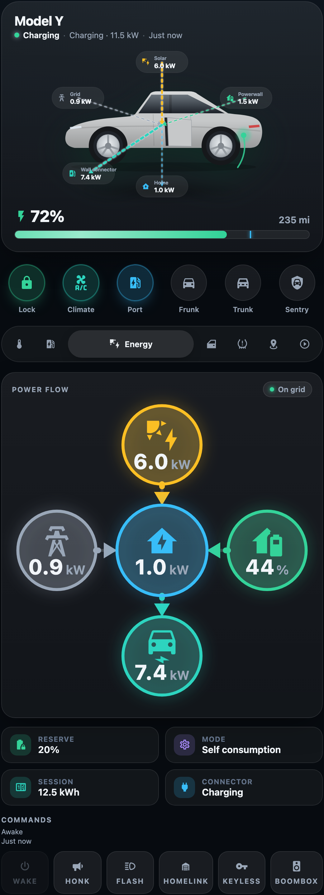
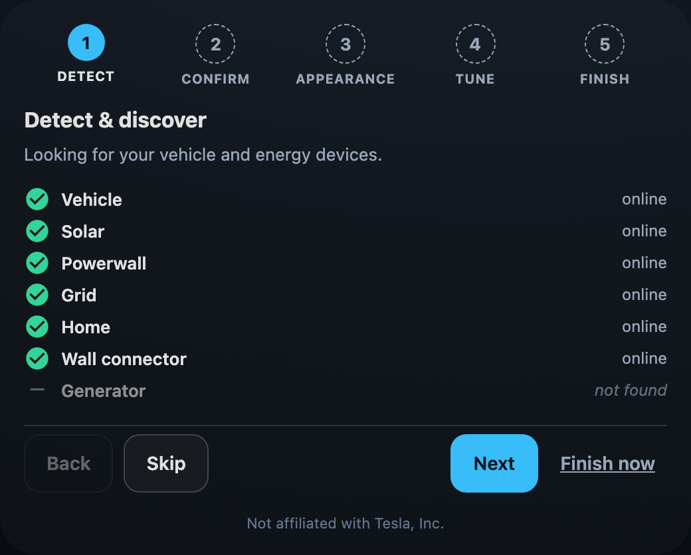
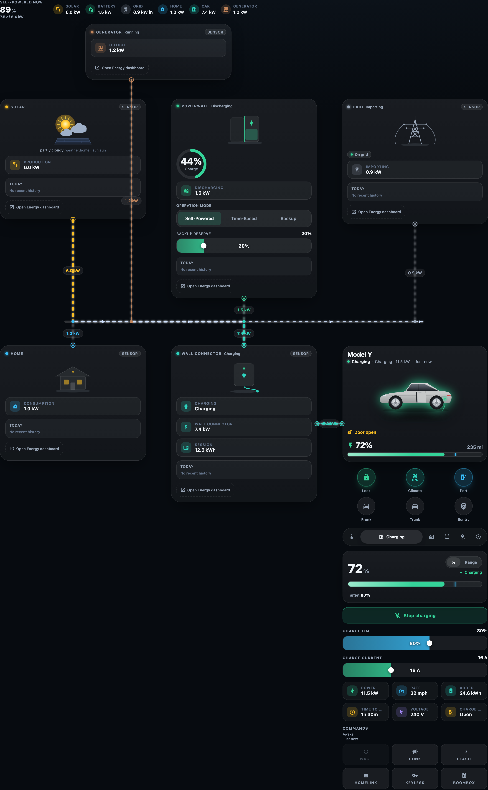

# Tesla Card

A Tesla-app-inspired vehicle card for Home Assistant, built for the
**Tesla Fleet** / **Teslemetry** integrations. Centred car render, circular
quick-action controls, and purpose-built detail panels — a tappable
closures diagram, live charging controls, climate with seat heaters, tyre
pressures, a map, the media player, and — when an energy site is detected —
a live energy-flow overlay. Set it up with **zero YAML** through the built-in
visual editor, and compose your whole home-energy picture with the matching
**My Home** scene.


## Features

- **Centred hero** — your car render front-and-centre with a live battery bar,
  charge-limit marker, charging shimmer, and a status line (*Charging · 1h 30m
  to 80%*, *Parked · Locked*, *Driving*, *Asleep*).
- **Quick actions** — circular toggles for lock, climate, charge port, frunk,
  trunk, and sentry, each lighting up in its own accent colour.
- **Closures diagram** — a tappable top-down schematic for frunk, trunk,
  windows, charge port, and doors, instead of a wall of identical buttons.
- **Charging** — battery summary, start/stop, draggable charge-limit and
  charge-current sliders, plus power / rate / energy / time-to-full / voltage.
- **Energy** — an auto-appearing power-flow diagram with status tiles when a
  Tesla **Powerwall** / **Wall Connector** (and an optional **generator**) is
  detected — see [Energy panel](#energy-panel).
- **Climate** — temperature stepper, per-seat heater cyclers (Off→Low→Med→High),
  steering-wheel heater, defrost, and cabin-overheat protection.
- **Tyres** — pressures at each corner of the car with low-pressure warnings,
  shown in **psi or bar** to taste.
- **Location** — embedded OpenStreetMap with odometer, speed, power, and live
  ETA when a route is active.
- **Media** — now-playing, transport, and a volume slider.
- **No-YAML visual editor** — a guided first-run setup wizard plus a full GUI
  config surface: confirm or remap any entity, pick a paint colour and a
  light/dark theme, choose units, and lay out the My Home scene — all without
  touching YAML — see [Visual editor & guided setup](#visual-editor--guided-setup).
- **Make it yours** — a card-only light/dark theme override and a paint-swatch
  picker, with a live preview as you choose — see [Theming](#theming).
- **Graceful asleep state** — when the vehicle is offline the card dims rather
  than showing a wall of *Unknown*.
- **Built-in car render** — a clean, recolorable EV illustration so a zero-config
  card looks right immediately; swap in your own `image:` or a layered `body:`
  render whenever you like — see [Recolorable car body](#recolorable-car-body).
- **Zero entity config** — auto-detects your Tesla and resolves every entity by
  its stable function-name, so it works whatever your vehicle is called; every
  key stays overridable — see [Entity resolution](#entity-resolution-automatic).
- **Private by design** — no telemetry, no analytics, no phone-home; all traffic
  rides your Home Assistant's own connection, enforced by a merge-blocking CI
  gate — see [Privacy](docs/privacy.md).

## Screenshots


|                                          |                                        |                                      |
| :---------------------------------------: | :-------------------------------------: | :-----------------------------------: |
|  |  |    |
|       Tappable **closures** diagram       |       **Climate** & seat heaters       |          **Tyre** pressures          |
|        |    |  |
|             **Media** player             |        Graceful **asleep** state        |          Live **energy** flow          |

## Requirements

- **Home Assistant 2024.4.0** or newer (the minimum supported version, pinned in
  `hacs.json`).
- The **Fleet / energy** features (live charging, the My Home scene, Powerwall
  controls) effectively need **2024.8+** with the `tesla_fleet` (or Teslemetry)
  integration providing the entities.

> The GUI editor uses Home Assistant's built-in `ha-form`/`ha-selector` components.
> These are not part of a guaranteed-stable public API; the editor is verified
> against HA 2024.4+ and may need updates if HA changes these internals. (This is
> an API-stability caveat, not a version cut-off — every widget the editor uses
> predates the 2024.4.0 floor.)

## Installation

### HACS (recommended)

1. HACS → **⋮** → *Custom repositories*.
2. Add `https://github.com/mlmeehan/tesla-card` with category **Dashboard**.
3. Install **Tesla Card**, then reload your browser.

The resource is registered automatically. For YAML-mode dashboards add:

```yaml
resources:
  - url: /hacsfiles/tesla-card/tesla-card.js
    type: module
```

### Manual

1. Download `tesla-card.js` from the [latest release](https://github.com/mlmeehan/tesla-card/releases).
2. Copy it to `config/www/tesla-card.js`.
3. *Settings → Dashboards → ⋮ → Resources → Add* `/local/tesla-card.js` as a
   **JavaScript module**.

## Usage

Add the card from the dashboard's card picker (**Tesla Card**), or drop in the
minimal YAML — it auto-detects your Tesla and shows a clean built-in car
illustration, so there's nothing else to configure:

```yaml
type: custom:tesla-card
name: Model Y
```

Prefer clicking to typing? Everything below can be configured in the
[visual editor](#visual-editor--guided-setup) — the YAML and the editor are two
views of the same config.

The built-in render recolours to any paint (see [Paint](#paint)):

```yaml
type: custom:tesla-card
name: Model Y
paint: blue
```

Bring your own render? Point `image:` at a file in `config/www/` (a transparent
PNG works best):

```yaml
type: custom:tesla-card
image: /local/model_y.png
```

## Visual editor & guided setup

You can configure the card entirely from Home Assistant's UI — **no YAML
required**. Add the card (or open an existing one via *Edit dashboard → the card's
pencil*), and the editor walks you through everything.



**First-run guided setup.** A fresh card opens a short, skippable wizard:

1. **Detect** — finds your Tesla (and any Powerwall / Wall Connector / generator)
   automatically. Nothing found? Map entities by hand right here — it never
   dead-ends.
2. **Confirm** — every resolved entity is listed with a live status marker
   (✓ online · ⚠ unavailable · ⚠ no data yet · — not found), so you can spot and
   remap a miss before it matters.
3. **Appearance** — pick a paint colour from the swatch grid, choose Auto / Light
   / Dark, and set the default panel, with a live card preview.
4. **Tune** — psi-or-bar tyre units and low-pressure thresholds, which sections
   to show, and whether to surface the Powerwall write-controls.
5. **Finish** — done. Re-run the wizard any time from the normal editor.

Each step saves as you go, so closing the editor, refreshing the browser, or
hopping to another device **resumes exactly where you left off**.

**Everyday editing.** An already-configured card opens straight to the normal
form: the discovery summary (with the same live status markers and an
expand-in-place **remap** for any entity), appearance, tune, name/image, and —
for the My Home scene — the node layout controls. "Reset to auto" on any override
simply removes the key and hands the entity back to auto-detection.

The My Home scene has its **own** Scene-aware editor with a **Compose** step for
hiding, reordering, promoting, and duplicating nodes — see
[Customising the scene](#customising-the-scene).

## Options


| Option                   | Type         | Default       | Description                                                                                                                                                               |
| ------------------------ | ------------ | ------------- | ------------------------------------------------------------------------------------------------------------------------------------------------------------------------- |
| `type`                   | string       | —            | `custom:tesla-card` (required).                                                                                                                                           |
| `name`                   | string       | `Model Y`     | Vehicle name shown in the hero.                                                                                                                                           |
| `image`                  | string       | _built-in EV_ | Custom flat car render URL. When unset (and no`body`), the card shows its built-in recolorable EV illustration.                                                           |
| `body`                   | map          | _none_        | Recolorable car-body layer set — see[Recolorable car body](#recolorable-car-body).                                                                                       |
| `paint`                  | string\| map | _silver_      | Body colour for the built-in render or a`body` layer set: a CSS colour, a generic colour-preset name, or an entity source — see [Paint](#paint).                         |
| `appearance`             | map          | _auto_        | Card-only light/dark theme override — see[Theming](#theming).                                                                                                            |
| `device`                 | string       | _auto_        | Vehicle device id or name, if you have more than one Tesla.                                                                                                               |
| `prefix`                 | string       | _auto_        | Force the entity-id prefix slug (e.g.`model_y`). Rarely needed.                                                                                                           |
| `integration`            | string       | _auto_        | Force the integration dialect (`tesla_fleet` / `teslemetry`). Auto-detected; rarely needed.                                                                               |
| `entities`               | map          | _auto_        | Per-key entity overrides — see[Entity overrides](#entity-overrides-escape-hatch).                                                                                        |
| `default_panel`          | string       | `charging`    | One of`climate`, `charging`, `energy`, `closures`, `tyres`, `location`, `media`.                                                                                          |
| `variant`                | string       | `full`        | `full`, or `compact` (hero + status line + battery gauge only — a small dashboard tile).                                                                                 |
| `hide_quick_actions`     | boolean      | `false`       | Hide the circular quick-action row.                                                                                                                                       |
| `hide_panels`            | boolean      | `false`       | Hide the tabbed detail panels.                                                                                                                                            |
| `hide_commands`          | boolean      | `false`       | Hide the command buttons (wake/honk/flash/…).                                                                                                                            |
| `tyres`                  | map          | _auto_        | Display units (`psi`/`bar`) and low-pressure thresholds — see [Tyres](#tyres).                                                                                           |
| `energy`                 | map          | _auto_        | Energy-site / Wall-Connector wiring, hide switch, and My Home node customization — see[Energy panel](#energy-panel) and [Customising the scene](#customising-the-scene). |
| `weather`                | map          | _auto_        | Source (or hide) the Solar card's live-weather vignette —`{ entity, sun, hide }`.                                                                                        |
| `wake_cooldown`          | number       | `1`           | Minutes to wait between implicit wake attempts (never blocks an explicit wake).                                                                                           |
| `notify_hidden_detected` | boolean      | `true`        | Show the calm "detected but hidden" advisory in the My Home scene when a hidden node is actually live.                                                                    |

### Entity resolution (automatic)

You normally **don't configure any entities**. The card finds your Tesla device
from the integration and resolves every value it needs by the entity's stable
function-name — the language-independent slug of its friendly name, e.g.
*Time to full charge* → `time_to_full_charge`. Only the device-name prefix of an
entity id varies between installs (`garage_model_y_…` vs `model_y_…` vs
`tesla_…`); the function-name does not, so matching on it works across
environments without hard-coded ids.

If you have **more than one Tesla**, point the card at the right one by device
name (or registry id):

```yaml
type: custom:tesla-card
device: Model Y          # or the device's name in Settings → Devices
```

### Entity overrides (escape hatch)

Auto-resolution falls back to sensible defaults, so overrides are only needed
when something is renamed unusually — and the editor's **remap** does this for
you with a picker. In YAML, override only the keys that differ:

```yaml
type: custom:tesla-card
entities:
  battery_level: sensor.my_tesla_battery_level
  lock: lock.my_tesla_lock
  charge_limit: number.my_tesla_charge_limit
  # …any of the keys in src/const.ts
```

The full list of keys (~84) lives in [`src/const.ts`](src/const.ts).

## Recolorable car body

Out of the box the hero shows a **built-in EV illustration** that already
recolours to any [paint](#paint), so a fresh install looks right with zero
config. Point `image:` at your own render to replace it, or — for a photoreal
car that *also* recolours to any colour — supply a **layered body render** so one
asset set covers every colour instead of one PNG per colour.

```yaml
type: custom:tesla-card
name: Model Y
paint: blue               # or '#2a4f93', or an entity (see Paint)
body:
  color: /local/tesla-card/color.webp      # base: glass, wheels, lights, shadow
  shade: /local/tesla-card/shade.webp      # grayscale form, composited ×multiply
  highlight: /local/tesla-card/highlight.webp  # clearcoat glints, ×screen (optional)
  mask: /local/tesla-card/mask.png         # white = the paintable body region
  # width: 1024   # intrinsic layer size for the viewBox (defaults to 1024×687)
  # height: 687
```

How it composites: inside the `mask`, the card stacks your `paint`, the `shade`
layer (`multiply`), and the `highlight` layer (`screen`) over the `color` base.
All per-vehicle geometry lives in the **mask**, so the renderer itself is generic.

The step-by-step pipeline for baking the four layers from a single source image
is in **[docs/recolorable-body.md](docs/recolorable-body.md)**. Bringing your own
render or running multiple models? See **[docs/asset-packs.md](docs/asset-packs.md)**
(`@unstable`) for WebP externalization, per-model placement, and swapping models
by URL.

> **Trademark note.** No vehicle artwork ships with this card: the built-in EV
> illustration is deliberately generic — not modelled on any specific vehicle —
> and you bring your own render for a photoreal look. Tesla's vehicle designs are
> trade dress and its badges/wordmark are trademarks, so use a render you have
> the right to use, keep it for your personal install, and don't redistribute
> Tesla's artwork. A generic EV silhouette is the safe default for anything
> public.

## Paint

`paint` colours the built-in EV render and a `body` layer set; it has no effect
on a custom `image`, which can't be tinted. It accepts three forms:

```yaml
paint: '#2a4f93'          # 1. any CSS colour (hex, rgb(), hsl(), named…)
paint: blue               # 2. a generic colour-preset name (see list below)
paint:                    # 3. read the colour live from an entity
  entity: sensor.my_exterior_color
  attribute: null         # optional: read this attribute instead of the state
  map:                    # optional: extra name→colour entries (override the presets)
    Deep Blue: '#2a4f93'  # ← bring your own vendor names here
    My Custom Wrap: '#114b3a'
  default: '#9aa3ad'      # used when the entity yields nothing usable
```

The bundled presets are **generic colour names** only: *white*, *silver*,
*lightsilver*, *grey*/*gray*, *darkgrey*/*darkgray*, *charcoal*, *black*, *blue*,
*red*, *brightred* and *darkred* (matching is case/space-insensitive). No vendor
marketing names or option codes are bundled — if you want a name like *Deep Blue*,
add it under the source's `map` (as above) or just pass the literal hex. The
editor's swatch picker writes the matching preset hex for you.

> **Heads-up:** the official `tesla_fleet` integration does **not** expose an
> exterior-colour entity. The entity form (3) is for a template/helper sensor
> you create, or a colour-aware integration. With plain Tesla Fleet, just set a
> literal colour or name.

## Theming

By default the card uses its own dark glass look. To flip just this card to a
light palette (without touching your dashboard's global theme), set
`appearance.theme`:

```yaml
type: custom:tesla-card
appearance:
  theme: light            # 'light' | 'dark'; omit for Auto (the card's default dark)
```

The override re-resolves the card's own colour tokens only — the surrounding
dashboard chrome is untouched, and the accent colours stay meaningful on either
ground. The editor's **Appearance** step exposes this as an Auto / Light / Dark
segmented control with a live preview.

## Tyres

The Tyres panel shows pressure at each corner and warns when one drops below a
recommended baseline. By default it reads the sensor's native unit and derives a
peer baseline (the max of the four live corners) with an overnight-temp-robust
margin. To pin the display unit or the thresholds:

```yaml
type: custom:tesla-card
tyres:
  units: psi              # 'psi' | 'bar' for the read-outs; omit for the native unit
  recommended: 42         # cold-pressure baseline, in the sensor's native unit
  margin: 4               # how far below 'recommended' a corner must fall to warn
```

The low-pressure check always runs in the sensor's native unit (which may be psi,
bar, or kPa); `units` only changes how the numbers are displayed.

## Energy panel

If you run a **Tesla Powerwall**, **Wall Connector** and/or a **generator**, the
card adds an **Energy** tab with a live power-flow diagram and status tiles.
Everything is **auto-detected** from the `tesla_fleet` / `powerwall` integration —
there's nothing to configure in the common case; the tab simply appears when an
energy site is found and stays hidden otherwise.

To override a specific entity, hide the panel even when a site is detected, or
hide the Powerwall write-controls:

```yaml
type: custom:tesla-card
energy:
  hide: false                       # set true to suppress the Energy tab entirely
  hide_powerwall_controls: false    # set true to hide the mode select + reserve slider
  entities:                         # override only what auto-detection gets wrong
    solar_power: sensor.my_home_solar_power
    battery_power: sensor.my_home_battery_power      # −charging / +discharging
    load_power: sensor.my_home_load_power
    grid_power: sensor.my_home_grid_power            # +import / −export
    powerwall_level: sensor.my_home_percentage_charged
    grid_status: sensor.my_home_grid_status
    backup_reserve: number.my_home_backup_reserve
    operation_mode: select.my_home_operation_mode
    generator_power: sensor.my_generator_power       # optional standby/backup generator
    wc_power: sensor.tesla_wall_connector_power
    wc_session: sensor.tesla_wall_connector_session_energy
    wc_connected: binary_sensor.tesla_wall_connector_vehicle_connected
    wc_status: sensor.tesla_wall_connector_status
```

Any key you omit is auto-resolved; any hardware you don't have is simply left
out of the diagram.

## My Home scene

If you run a **Powerwall**, **Wall Connector** and/or **generator**, a second,
standalone card — **`tc-my-home`** — composes your whole home-energy picture into
one view: Solar, Powerwall, Grid, Home, Wall Connector and (when present)
Generator cards laid out in two rows, with your car joining the load row, all tied
together by a live **Gateway bus** that shows power flowing between them. A summary
ribbon leads with how *self-powered* your home is right now.



It's a separate card from `custom:tesla-card`, added on its own (or from the card
picker as **My Home**):

```yaml
type: custom:tc-my-home
```

Like the main card it **auto-detects** the energy site and vehicle from the
`tesla_fleet` / `powerwall` integration — there's nothing to configure. Any node
you don't have is simply left out (no ghost cells); hovering or focusing a card
lights its couplings and dims the rest; the cards grow to fill a wide column (up
to a sensible cap) and pack to a single column on a phone with the bus re-routed
vertically. The embedded vehicle cell is a real `tesla-card`, so it honours your
`default_panel` and hide-switches too. It's a wide composition — give it a
full-width dashboard column.

Each energy node is also available as its own standalone card from the picker
(`tc-solar`, `tc-powerwall`, `tc-grid`, `tc-home`, `tc-wall-connector`,
`tc-generator`) if you'd rather place them individually.

### Customising the scene

The scene has its own visual editor (open it like any card) with a **Compose**
step to hide, reorder, promote between rows, and duplicate nodes. In YAML, the
same lives under `energy.nodes`:

```yaml
type: custom:tc-my-home
energy:
  nodes:
    hide: [grid]               # remove a node from the scene entirely
    order: [powerwall, solar]  # left-to-right order within a row
    rows:
      generator: source        # draw a node in the other row (source ⇆ load)
    instances:                 # show more than one of a kind
      powerwall:
        - title: Garage        # first unit: auto-detected
        - title: Shed          # second unit: give it its own sensors
          entities:
            powerwall_level: sensor.shed_charge
            battery_power: sensor.shed_power
      vehicle:
        - {}                   # first car: auto-detected
        - title: Model 3       # a second car, with its own embedded config
          config:
            device: Model 3
```

Every key here is optional and additive — omit `energy.nodes` and you get
today's fully auto-detected scene.

## Development

```bash
npm install
npm run dev        # Vite dev server with hot-reload → http://localhost:5173/
npm run build      # → dist/tesla-card.js
npm run watch      # rebuild on change
npm run typecheck  # strict tsc, no emit
npm test           # unit tests (Vitest)
npm run test:e2e   # Playwright end-to-end tests
```

`npm run dev` serves the `demo/` harness with hot-module reload — it renders the
card against a mock `hass` object (awake / charging and asleep scenarios) with no
Home Assistant required, handy for visual work. (`npm run build` then
`npm run serve:demo` serves the built bundle at `http://127.0.0.1:4173/demo/`.)
URL params:

- `?panel=energy` (or `climate`, `closures`, …) — open a panel directly.
- `?scenario=asleep` — the offline/dimmed state.
- `?editor=1` — open the GUI editor; `?setup=1` — open the guided setup wizard.
- `?env=renamed` — re-prefix the vehicle entities (`my_tesla_*`) to prove
  name-based resolution.
- `?paint=Deep%20Blue` (or `%232f6ab0`) — tint the built-in EV render live.
- `?image=1` — show a custom flat `` instead of the built-in render.
- `?recolor=1&paint=Deep%20Blue` — exercise the photoreal recolorable body
  (needs your own layers in `demo/local/`, which is gitignored).
- `?colorentity=blue` — drive the paint from a mock colour entity.

## License

[MIT](LICENSE) © Mike Meehan. Not affiliated with Tesla, Inc.
